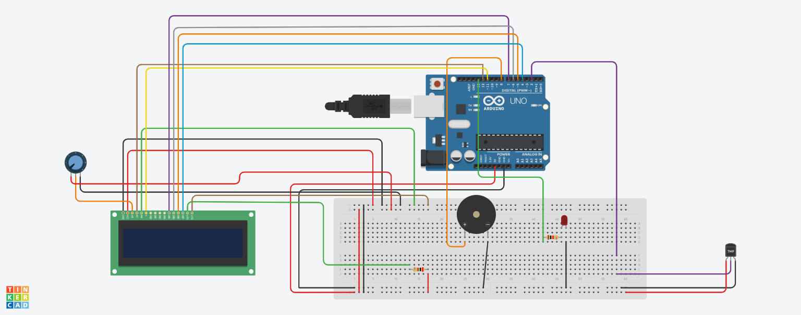
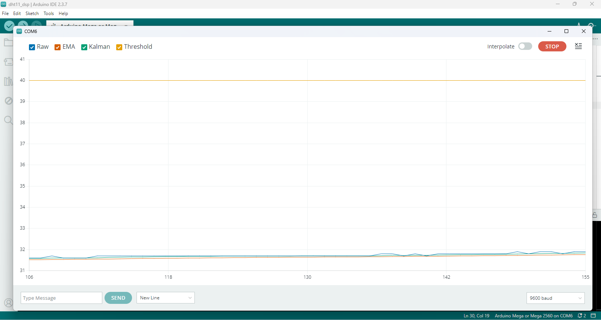
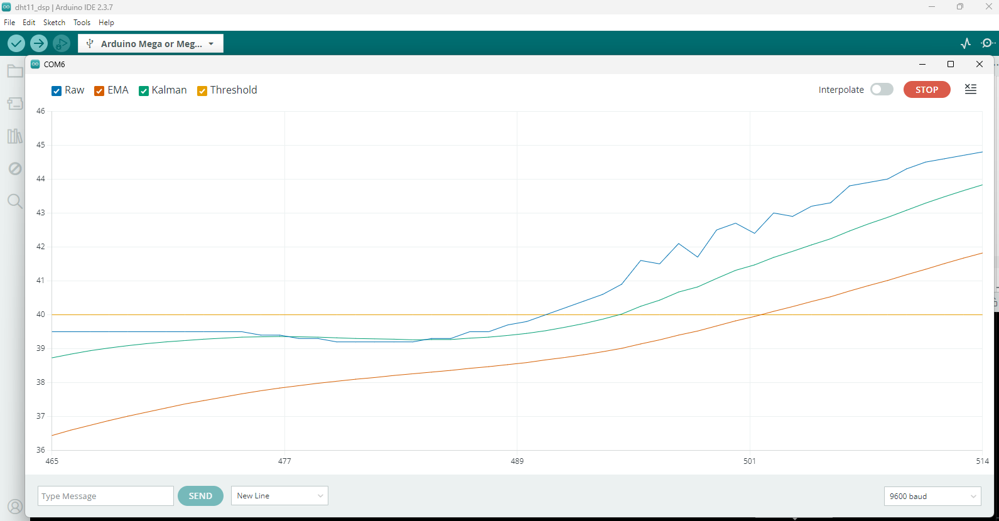
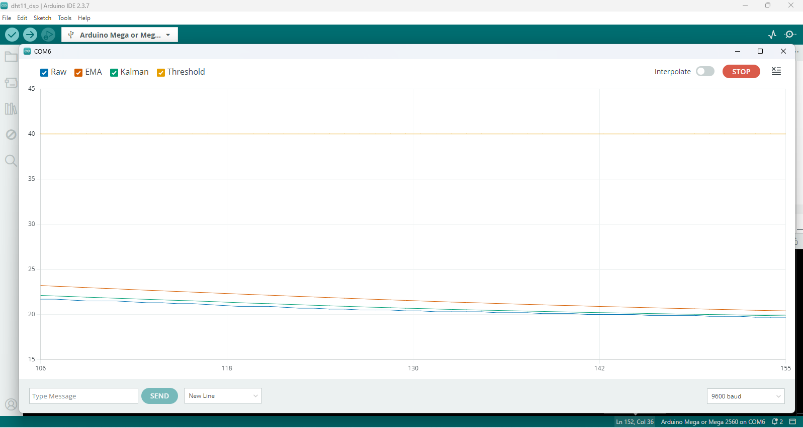

# Comparative Analysis of Kalman and EMA Filters for a Low-Cost Temperature Monitoring System
This project implements and compares the performance of Kalman and EMA (Exponential Moving Average) Filters for a low-cost temperature monitoring system which incorporates a DHT11 Temperature and Humidity Sensor.

## 📌 Project Overview

In industrial automation and control systems, sensor data is often noisy due to electrical interference or low-cost hardware limitations. To use this data for safety applications (like overheating alarms), 
it must be filtered. This project implements and evaluate the effect of two established digital signal processing (DSP) techniques, the Kalman and Exponential Moving Average (EMA) Filters for a temperature monitoring system using a 
low-cost DHT11 sensor.


## 🧮 Theoretical Background

**1. Kalman Filter**

  A recursive algorithm that finds the system's true state by minimizing error over time. Unlike the EMA, which applies a fixed smoothing factor, the Kalman filter uses a probabilistic model to dynamically weight the sensor data against its own prediction. This method allows it to filter out noise while reacting quickly to real changes.
   
  **Step A: Prediction**
  
  Projects the system state and error covariance forward to the next time step.
  
  $$\hat{x}^-_k = \hat{x}_{k-1}$$
  
  $$P^-_k = P_{k-1} + Q$$
  
  **Step B: Correction**
  
  Corrects the predicted state by incorporating the new sensor measurement ($z_k$) weighted by the calculated Kalman Gain ($K$), and updating the error covariance ($P_k$).
  
  $$K_k = P^-_k ( P^-_k + R )^{-1}$$
  
  $$\hat{x}_k = \hat{x}^-_k + K_k ( z_k - \hat{x}^-_k )$$

  $P_k = (1 - K_k)P_{k}^{-}$
  
  Where,
  
  **$Q$ (Process Noise):** Represents system dynamics Uncertainty.
  
  **$R$ (Measurement Noise Covariance):** Represents sensor uncertainty.
  
  **$K$: Kalman Gain:** Represents the weighting applied to the new measurement during the correction step.

  

**2. Exponential Moving Average (EMA) Filter**

   A simple first-order low-pass filter used to smooth out high-frequency noise by averaging the new reading with the previous one. The EMA filter relies heavily on historical data, which makes it react slowly to changes.
   
   $$y[n] = \alpha \cdot x[n] + (1 - \alpha) \cdot y[n-1]$$
   
   Where $\alpha$ is the smoothing factor that determines the weight given to the most recent measurement. A lower $\alpha$ results in smoother data but slower response time.
   

## 🛠 Hardware Architecture

* **Microcontroller:** Arduino Mega 2560

* **Sensor:** DHT11 Temperature & Humidity Sensor

* **Display:** 16x2 LCD Module (A 50k Ohm Potentiometer was used to adjust screen contrast)

* **Alarm System:** 5V Active Buzzer and LED Indicator

* **Language:** Embedded C++


## 📐 Circuit Diagram

The circuit diagram was developed using [Tinkercad]([https://plant-disease-prediction-using-deep-learning-cnn-and-keras.streamlit.app/](https://www.tinkercad.com/))
<p align="center">
   
</p>


## 📁 Repository Structure
<pre>
├── arduino_code
│   ├── dht11_temp_monitor_sys.ino
├── results
│   ├── cold_source_test.png
│   ├── heat_source_test.png
│   ├── steady_state_test.png  
├── schematics
│   ├── circuit_diagram.png
│   ├── pinout_table.md  
├── LICENSE
└── README.md
</pre>


## 🌐 Running the System

### Prerequisites

* **Arduino IDE**
* **Complete Hardware Setup**


### 1. Clone the Repository
```bash
git clone https://github.com/Oluwatobi-coder/Comparative-Analysis-Kalman-vs-EMA-Temperature-Monitoring-System.git
cd Comparative-Analysis-Kalman-vs-EMA-Temperature-Monitoring-System.git
```

### 2. Upload Code to your Microcontroller

After setting up your hardware (refer to `circuit_diagram.png` and `pinout_table.md` in the `schematics` folder):

1. Navigate to the `arduino_code` directory.

2. Open the `dht11_temp_monitor_sys.ino` file in the Arduino IDE.
  
3. Install the following dependencies: `LiquidCrystal` and `DHT sensor library`.
   
5. Compile and Upload the code to your microcontroller (Arduino Mega 2560 or Arduin Uno).

6. Open the Serial Plotter (set data transmission rate to '9600 baud') to visualize the real-time temperature readings.


## 📊 Results & Discussion

The performance of the filters was evaluated across three different states using the Arduino Serial Plotter.

### 1. Steady-State (Room Temperature)

<p align="center">
   
</p>

At room temperature, the raw sensor data **(blue)** shows constant small fluctuations. Both the Kalman **(green)** and EMA **(orange)** filters smooth out these sensor distortions, creating a steady, flat line. This proves that when the temperature isn't changing, both filters are equally effective at removing non-rapidly changing sensor noise.

### 2. Heat State (Rapid Rise)

<p align="center">
   
</p>

When heat is applied, the raw sensor data rises quickly. The Kalman filter follows this rise almost immediately. However, the EMA filter reacts much slower and always stay below the raw temperature and the kalman filtered temperature. This demonstrates that the EMA filter introduces a significant lag during rapid changes, while the Kalman filter does not.

### 3. Cold State (Rapid Drop)

<p align="center">
   
</p>

When the environment is being cooled, the Kalman filter gain tracks the temperature drop in at a fast rate. The EMA filter struggles to keep up, remaining higher than the true temperature as it slowly averages the new data. This confirms that the Kalman filter is more responsive than the EMA filter during any sudden temperature shift, whether it is getting hotter or colder.


## 📝 Conclusion

While both filters effectively remove noise, the Kalman Filter shows excellent results for this application because it provides smooth output without the lag seen in the
EMA filter. This makes it more robust for real-time temperature monitoring systems.


## 🤝 Contributing

Contributions are welcome! If you have suggestions for improving the arduino code, filter algorithm or hardware setup:

* Fork the repository.

* Create a new branch (`git checkout -b feature-branch`).

* Commit your changes.

* Push to the branch and open a Pull Request.


## 📚 References

**HandsOn Technology.** (2026). DHT11 Humidity & Temperature Sensor Datasheet. Retrieved from https://www.handsontec.com/dataspecs/sensor/DHT11%20Humidity%20Temp%20Sensor.pdf

**Ogata, K.** (2010). Modern Control Engineering (5th Edition). Prentice Hall.

**Smith, S. W.** (1997). The Scientist and Engineer's Guide to Digital Signal Processing. California Technical Publishing.

**Welch, G., & Bishop, G.** (1995). An Introduction to the Kalman Filter. University of North Carolina at Chapel Hill.


## 📜 License

This project is licensed under the MIT License - see the `LICENSE file` for details.

## 
If you find this implementation helpful in your own work, feel free to ⭐ the repository to help others find it.
